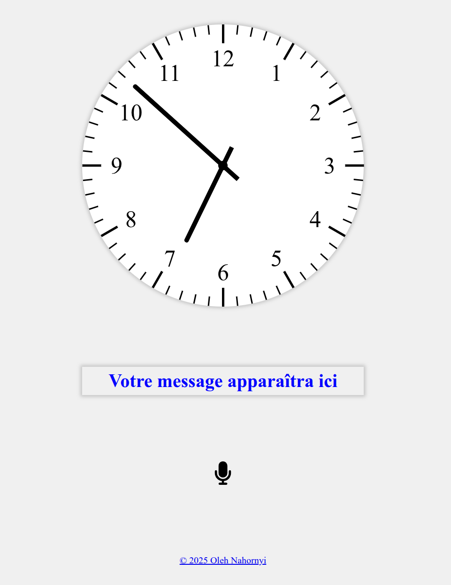

# iClock

A simple, elegant web-based clock application that displays the current time in a clean, easy-to-read format.



## Features

- Real-time clock display
- Clean, responsive design
- Easy to read time format
- Lightweight and fast

## Project Structure

```bash
├── src/
│   ├── index.html     # Main HTML file
│   ├── main.js        # Main JavaScript file
│   ├── msg.css        # Message styling
│   ├── msg2time.js    # Time conversion utilities
│   ├── parsetime.js   # Time parsing functionality
│   └── style.css      # Main stylesheet
├── package.json       # Project configuration
└── README.md          # This file
```

## Getting Started

1. Clone the repository:

   ```bash
   git clone https://github.com/oleg578/iclock.git
   cd iclock
   ```

2. Open `src/index.html` in your web browser to run the application.

## Usage

This is one small toy for learning French.

Simply open the `index.html` file in any modern web browser to see the clock in action.

The clock updates in real-time to show the current time.

Activate microphone by clicking on the microphone icon.

Speak into the microphone any time in French.

If the time is recognized, it will be set and displayed in the message field.

## Browser Support

The application is compatible with all modern web browsers including:

- Google Chrome
- Mozilla Firefox
- Safari
- Microsoft Edge

## License

This project is open source and available under the [MIT License](LICENSE).

## Contributing

Contributions are welcome! Please feel free to submit a Pull Request.

## Author

Oleh Nahornyi - [oleg.nahornyi@gmail.com]
